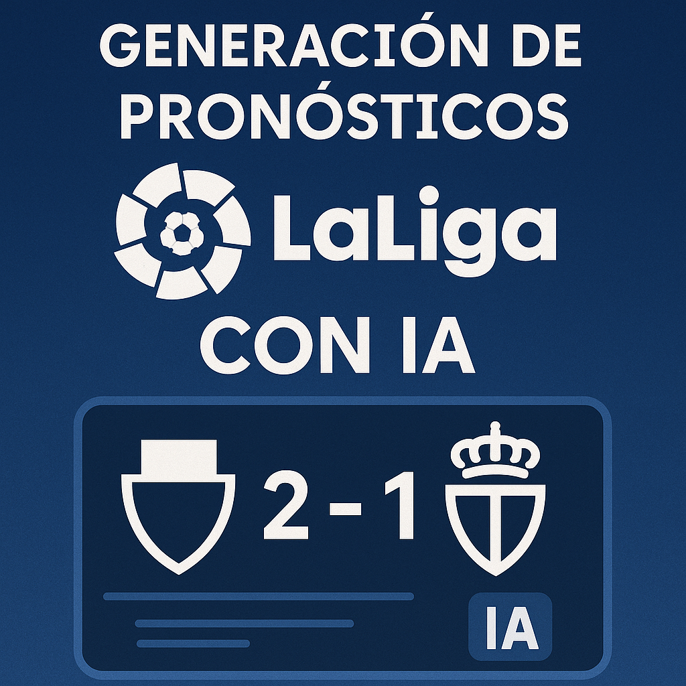
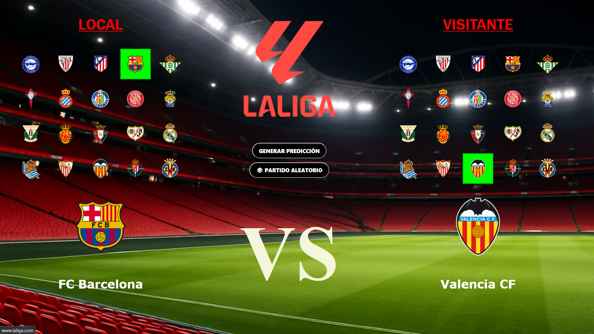
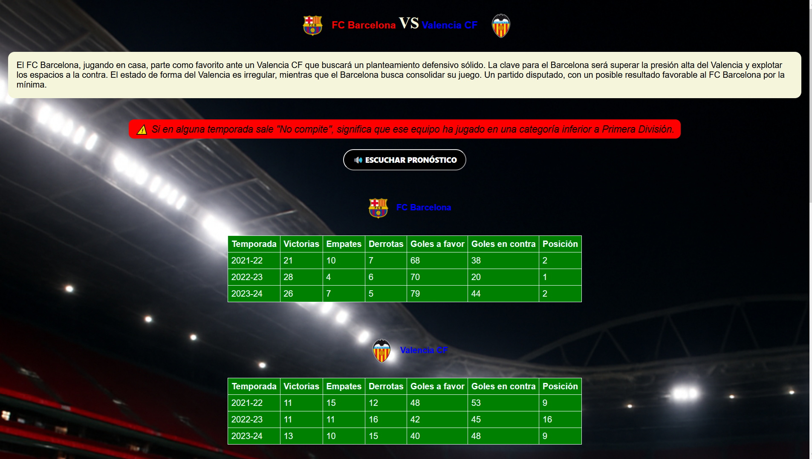

# PROYECTO INTEGRADO  
## Página Web Interactiva con IA

**Autor:** José Antonio García Rubio  
**Tutor:** Francisco Javier Ávila Sánchez  
**Centro:** I.E.S. Francisco Romero Vargas (Jerez de la Frontera)  
**Ciclo:** Administración de Sistemas Informáticos en Red  
**Curso:** 2024/2025

---

## ÍNDICE

1. [Introducción](#1-introducción)  
   1.1 [Introducción](#11-introducción)  
   1.2 [Finalidad](#12-finalidad)  
2. [Objetivos](#2-objetivos)  
3. [Medios necesarios](#3-medios-necesarios)  
   3.1 [Hardware](#31-hardware)  
   3.2 [Software](#32-software)  
4. [Planificación](#4-planificación)  
5. [Realización del trabajo](#5-realización-del-trabajo)  
   5.1 [Trabajos realizados](#51-trabajos-realizados)  
6. [Problemas encontrados](#6-problemas-encontrados)  
7. [Posibles mejoras del proyecto](#7-posibles-mejoras-del-proyecto)  
8. [Conclusión](#8-conclusión)  
9. [Bibliografía](#9-bibliografía)  

---

## 1. Introducción

### 1.1 Introducción

El objetivo de este proyecto es generar un pronóstico para un partido entre dos equipos de La Liga EA Sports. Para ello, se recopilan y analizan datos de temporadas anteriores de ambos equipos. Utilizando técnicas de inteligencia artificial, se elabora una predicción del resultado y se complementa con una narración en audio que describe el pronóstico de forma dinámica.

### 1.2 Finalidad

La finalidad de este proyecto es facilitar el trabajo de los analistas deportivos y de los clubes de fútbol, proporcionándoles una herramienta que les permita estudiar las estadísticas probables de los partidos que deseen. Además, se les ofrece la posibilidad de escuchar el pronóstico generado automáticamente mediante una narración en audio.

---

## 2. Objetivos

- **Desarrollar una página web interactiva**
  - Se debe crear una interfaz web amigable e intuitiva que permita a los usuarios seleccionar los equipos que desean enfrentar, utilizando sus respectivos escudos para ofrecer una experiencia visual más atractiva y reconocible.

- **Integrar la inteligencia artificial de Gemini**
  - Se utiliza el modelo de IA Gemini para analizar datos históricos de ambos equipos y generar un pronóstico preciso del posible resultado del encuentro, incluyendo estadísticas relevantes como posesión, goles esperados, rendimiento reciente, entre otros.

- **Generar una narración en audio con ElevenLabs**.
  - El pronóstico generado por la IA se convierte en una narración realista mediante la tecnología de síntesis de voz de ElevenLabs, lo que permite a los usuarios escuchar un resumen hablado del análisis del partido.

- Incorporar funcionalidades interactivas:
  - **Generar pronóstico** una vez seleccionados los equipos.

  - **Reproducir la narración en audio** del análisis generado.
  
  - **Reiniciar la selección de equipos** para analizar un nuevo enfrentamiento.
  
  - **Descargar pronóstico** en CSV o PDF.

---

## 3. Medios necesarios

### 3.1 Hardware

- **Ordenador personal de configuración media**
  - Se recomienda el uso de un equipo con un procesador potente, al menos 8 GB de memoria RAM y una unidad de almacenamiento SSD. Estas características permiten un desarrollo ágil, especialmente al trabajar con múltiples herramientas de desarrollo de forma simultánea.

- **Conexión estable a Internet**
  - Es indispensable contar con una conexión a Internet confiable y de alta velocidad, ya que se requiere acceder de forma continua a servicios basados en la nube, como las APIs de inteligencia artificial de ElevenLabs y Gemini, además de gestionar dependencias.

### 3.2 Software

- **Editor de código**: Visual Studio Code.  

- **APIs IA**:
  - **ElevenLabs**: se utiliza para generar la narración en audio del pronóstico.

  - **Gemini (Google AI)**: se utiliza para generar la narración en audio del pronóstico.

- **Lenguajes y tecnologías**:
  - **HTML**: se utiliza para estructurar la página web.

  - **CSS**: se emplea para diseñar y estilizar la interfaz de usuario.

  - **JavaScript**: se encarga de añadir interactividad, manejar eventos y conectar con las APIs.

  - **Python**: se usa para la gestión de datos, el procesamiento del análisis y, en caso de ser necesario, como backend en una arquitectura más robusta.

---

## 4. Planificación

| Tarea                         | Horas |
|-------------------------------|-------|
| Planificación del proyecto    | 10    |
| Diseño HTML                   | 20    |
| Diseño CSS                    | 20    |
| Diseño JavaScript             | 40    |
| Diseño Python                 | 40    |
| Implementación Gemini         | 10    |
| Implementación ElevenLabs     | 20    |
| Creación de alertas           | 1     |
| Pruebas y retoques finales    | 15    |
| Documentación                 | 10    |
| **Total aproximado**          | **186** |

---

## 5. Realización del trabajo

1. Investigación sobre IA.
  - El proyecto comenzó con una fase de planificación e investigación centrada en cómo aplicar inteligencia artificial a un sistema de pronóstico deportivo. En un primer momento, consideré utilizar la IA de Gemma, por lo que investigué su integración, sus requisitos técnicos, y si su uso implicaba algún tipo de coste. Además, definí la estructura básica de la página web y las funcionalidades que quería implementar, teniendo en cuenta aspectos como el manejo de peticiones API.
 
2. Desarrollo de `app.py` con integración Gemini y ElevenLabs.
  - Seguidamente, empecé con el backend en Python, creando el archivo app.py. Instalé e integré Gemini mediante su API Key y también la API de ElevenLabs para generar audio. Programé la lógica para que, al seleccionar dos equipos en la interfaz web, se procesa la información y se generará un pronóstico, incluyendo datos históricos de temporadas anteriores.

3. Estructura HTML con logotipo y botones.
  - Diseñé una página HTML sencilla e intuitiva. Incorporé el logotipo de LaLiga, menús o botones para seleccionar equipos, y funciones para generar tanto el pronóstico como el audio correspondiente. La interfaz fue pensada para ser clara y accesible.

4. Estilizado con CSS y escudos de equipos.
  - Con CSS, personalicé el diseño visual de la página. Utilicé un fondo relacionado con el fútbol y añadí los escudos de los equipos, que se muestran tanto al seleccionarlos como en los resultados, dando un aspecto más atractivo y profesional al sitio.

5. Funcionalidad JS para pronóstico, audio y reinicio.
  - Programé funciones en JavaScript para manejar las acciones del usuario: generar el pronóstico, reproducir el audio o volver atrás para seleccionar otros equipos. También añadí interacciones visuales, como seleccionar y deseleccionar equipos al hacer clic en sus escudos.

6. Pruebas completas.
  - Realicé diversas pruebas para asegurarme de que todos los elementos funcionaban correctamente: verificación de datos, enlaces, funcionamiento de las APIs y reproducción del audio. También comprobé que la aplicación cumpliera con todos los objetivos marcados al inicio.

7. Documentación y presentación.
  - Finalmente, documenté todo el proceso: planificación, diseño, tecnologías utilizadas, y resultados obtenidos. Preparé una presentación que resume el proyecto y destaca su utilidad, mostrando el funcionamiento del generador de pronósticos y sus posibles aplicaciones en el ámbito deportivo.

### 5.1 Trabajos realizados por semana

- **Semana 1**: Planificación e investigación de IA.
  - Durante esta semana comencé a planear mi proyecto e investigué cuáles serían las mejores inteligencias artificiales para usar y como insertarlas en mi proyecto.

- **Semana 2**: Integración IA y creación `app.py`.
  - Durante esta semana instalo con claves API la IA de Gemma, la cual descargué en mi ordenador para usar en local y también API Football, para la información de los equipos.

- **Semana 3-4**: HTML y pruebas iniciales.
  - Creación del HTML y primeras pruebas de la página: En este proceso, realizo muchas pruebas, ya que el código daba muchos fallos y tenía que encontrar esos pequeños errores para avanzar.

- **Semana 5**: Avance con CSS y primer pronóstico.
  - Consigo que de las estadísticas y un pronóstico genérico, cambiando depende de la probabilidad de victoria de cada equipo. Creo el CSS para que la página sea más vistosa y se ajusten las tablas y los títulos bien a la página.

- **Semana 6**: Problemas con Gemma y API Football.
  - La Ia de Gemma no es útil para generar un pronóstico automáticamente y la IA de API Football solo tiene 100 request diarias por lo que investigando veo mejor opción usar Gemini.

- **Semana 7**: Sustitución por Gemini.
  - Busqué como podía implantar Gemini en mi proyecto sustituyendo a Gemma y ya no me hace falta la IA de API Footbal ya que con Gemini puedo obtener la misma información sobre los equipos.

- **Semana 8**: Desarrollo de JavaScript.
  - Creo el JavaScript ya que quiero crear varias funciones para hacer una página más interactiva y con mejor funcionalidad. Añado un par de funciones y voy probando.

  

  

  
- **Semana 9**: Funcionalidad completa, descarga CSV/PDF.
  - Consigo que mi página haga exactamente lo que quiero, con un pronóstico realista, con datos verificados y con una funcionalidad del 100%, añadiendo que se pueda descargar el pronóstico y las estadísticas en CSV o PDF.

  

  - **Archivo CSV:**
  

  - **Archivo PDF:**
  

- **Semana 10**: Últimos retoques visuales.
  - Hago unos últimos cambios en el CSS para que todo quede bien situado y que se vea claro todos los contenidos. Por último verifico que todo funciona correctamente.

- **Semana 11**: Documentación final.
  - Documento todo el desarrollo del proyecto y preparo la presentación final.

---

## 6. Problemas encontrados

- **Dificultad al generar el pronóstico**
  - Actualmente, la inteligencia artificial de Gemma presenta una limitación importante: no es capaz de generar automáticamente un pronóstico basado en las estadísticas de los equipos. Esta carencia impide automatizar uno de los procesos clave del sistema, ya que requiere intervención manual o el uso de herramientas externas para obtener los resultados deseados.

  - **Solución**:
  Sustituir la IA de Gemma por la IA de Gemini, la cual sí tiene la capacidad de generar pronósticos automáticamente al recibir un prompt adecuado. Este prompt ya se encuentra definido en el archivo app.py, lo que facilitaría la integración y permitiría automatizar completamente la generación de pronósticos a partir de los datos estadísticos disponibles.

- **Restricción de request**
  - La inteligencia artificial basada en la API de Football presentaba dos limitaciones significativas: por un lado, solo permitía realizar hasta 100 solicitudes gratuitas por día, lo que restringía severamente la escalabilidad y el acceso continuo a los datos. Por otro lado, su cobertura temporal de información estaba limitada al período comprendido entre 2021 y 2024, lo que dificultaba el análisis histórico más amplio o la elaboración de comparativas con datos anteriores.

  - **Solución**:
  Migrar al uso de la IA de Gemini, que ofrece solicitudes ilimitadas y acceso a una base de datos mucho más extensa. Esta IA permite consultar información desde el año 2024 hacia cualquier año anterior, lo que amplía considerablemente el rango de análisis y elimina las restricciones de uso diario, mejorando tanto la eficiencia como la profundidad del sistema de pronóstico.

- **Limitación de tiempo con la IA de voz**
  - Inicialmente, se consideró utilizar la IA de voz de FakeYou debido a su capacidad para generar audios con voces imitadas de personajes reconocidos, lo cual resultaba atractivo para dar un toque más realista y entretenido a la narración de los pronósticos. Sin embargo, esta solución presentaba una limitación crítica: solo permitía generar clips de audio de hasta 10 segundos, una duración claramente insuficiente para narrar un pronóstico completo de manera coherente y fluida.

  - **Solución**:
  Se decidió cambiar a la IA de voz de ElevenLabs, que permite generar audios de mayor duración de forma gratuita, lo que la hace mucho más adecuada para este tipo de contenido. Además, se está trabajando en personalizar su salida para que la entonación y estilo de la voz imiten a la de un comentarista deportivo, mejorando así la experiencia del usuario y aportando un nivel de realismo más alto al sistema de pronóstico automatizado.

---

## 7. Posibles mejoras del proyecto

- **Actualización en tiempo real con APIs oficiales**
  -  Integrar una fuente de datos en vivo (como APIs deportivas oficiales o servicios como Opta, SportRadar o API-Football) que permita actualizar automáticamente estadísticas, alineaciones, resultados recientes y otros datos relevantes. Esto garantizaría que los pronósticos se basen en información actualizada y precisa, mejorando significativamente su fiabilidad.

- **Ampliación a más ligas y competiciones**
  - Incluir ligas internacionales (como la Premier League, Bundesliga, Serie A, etc.) y torneos continentales o globales (Champions League, Copa Libertadores, Mundial, Eurocopa, entre otros). Esto permitirá que la herramienta sea utilizada por analistas, aficionados y clubes de diferentes países, ampliando su alcance y utilidad.

- **Fichas completas de clubes y jugadores**
  - Incorporar fichas informativas completas para cada club, incluyendo historial de títulos, estadísticas de plantilla, rendimiento individual de los jugadores, transferencias recientes y datos de lesiones. Esto enriquecerá el análisis y proporcionará a los usuarios un contexto más profundo para tomar decisiones o realizar estudios deportivos más completos.
- **Compartir el modelo con otros usuarios**
  - Compartir nuestro modelo con otros usuarios puede ser una estrategia muy útil y enriquecedora. Al permitir que otras personas accedan y trabajen con el modelo, se abre la posibilidad de generar una especie de competencia amistosa para ver quién logra crear una versión más realista o precisa. Esta dinámica no solo fomenta la colaboración y el intercambio de ideas, sino que también puede revelar nuevas perspectivas y enfoques que quizás no habíamos considerado. Además, al observar cómo otros optimizan el modelo, podemos identificar mejoras tanto en el código como en la estructura de la página, y también en los métodos utilizados para entrenar a la inteligencia artificial. En conjunto, esta interacción con otros desarrolladores y usuarios puede acelerar el proceso de desarrollo y perfeccionamiento del modelo, contribuyendo así a obtener resultados más eficientes y de mayor calidad.
- **Implementar un modelo de explicación de la IA**
  - Una de las mejoras clave que podríamos implementar en nuestro sistema es la incorporación de un modelo explicativo que nos permita entender en qué se basa la inteligencia artificial para generar sus pronósticos. Esta funcionalidad resulta fundamental, ya que no solo incrementa la transparencia del modelo, sino que también permite evaluar la lógica detrás de cada predicción. Por ejemplo, el modelo podría explicar si el pronóstico se debe al rendimiento reciente de los jugadores, a la estrategia del entrenador, al desempeño general de los equipos, o incluso al historial de enfrentamientos previos entre ambos conjuntos.
     Para lograr esto, una herramienta muy útil que podemos utilizar es SHAP (SHapley Additive exPlanations). SHAP no es un modelo que predice por sí mismo, ni aprende directamente del comportamiento de los datos, sino que actúa como una capa de interpretación sobre un modelo ya entrenado. Su función principal es descomponer cada predicción en los factores que más influyeron en ella, permitiéndonos entender con claridad por qué la inteligencia artificial llegó a una determinada conclusión. Esta capacidad de análisis no solo mejora la confianza en el sistema, sino que también puede ser clave para ajustar y perfeccionar los modelos existentes.

---

## 8. Conclusión

- Durante el desarrollo de este proyecto, centrado en la creación de un sistema de pronóstico deportivo mediante el uso de inteligencia artificial, se ha tenido la oportunidad de aplicar, reforzar y ampliar los conocimientos adquiridos a lo largo de varios años. Herramientas como HTML, CSS y JavaScript, que forman parte esencial del desarrollo web, han sido clave en la construcción de la interfaz del proyecto. Asimismo, se ha profundizado en el uso del lenguaje de programación Python, fundamental para la implementación y conexión de los modelos de inteligencia artificial. Este aprendizaje ha resultado especialmente valioso, ya que Python se considera una herramienta indispensable para el futuro profesional, dada su versatilidad y presencia en múltiples áreas tecnológicas.

- Uno de los aspectos más valorados durante la realización de este trabajo ha sido enfrentar numerosos errores y obstáculos técnicos. Aunque en algunos momentos resultó frustrante, el proceso de búsqueda de soluciones y la superación de cada dificultad permitieron desarrollar habilidades importantes como la perseverancia, la resolución de problemas y la autonomía. Ver cómo, después de muchas horas de esfuerzo, el sistema finalmente funciona como se esperaba y ha sido una de las mayores satisfacciones del proyecto. Esa sensación de logro compensa todo el trabajo invertido y refuerza la motivación para seguir aprendiendo.

- Se está convencido de que el resultado final es una página web útil y funcional, especialmente dirigida a personas que trabajan o están interesadas en el ámbito del fútbol. En caso de dedicarme profesionalmente a este sector en el futuro, no dudaría en seguir desarrollando y mejorando este proyecto, añadiendo nuevas funcionalidades, optimizando su rendimiento e incorporando los avances tecnológicos que vayan surgiendo.

- En conclusión, este proyecto ha permitido recordar conceptos previamente aprendidos, adquirir nuevos conocimientos y, sobre todo, desarrollar la capacidad de superar dificultades técnicas y personales a lo largo del camino. Ha sido una experiencia enriquecedora tanto en lo académico como en lo personal, y deja preparado para afrontar con confianza nuevos retos tecnológicos en el futuro.

---

## 9. Bibliografía

- Gemma: [https://deepmind.google/models/gemma/?hl=es-419](https://deepmind.google/models/gemma/?hl=es-419)  
- API Football: [https://www.api-football.com/](https://www.api-football.com/)  
- Gemini: [https://console.cloud.google.com/](https://console.cloud.google.com/)  
- ElevenLabs: [https://elevenlabs.io/app/home](https://elevenlabs.io/app/home)

